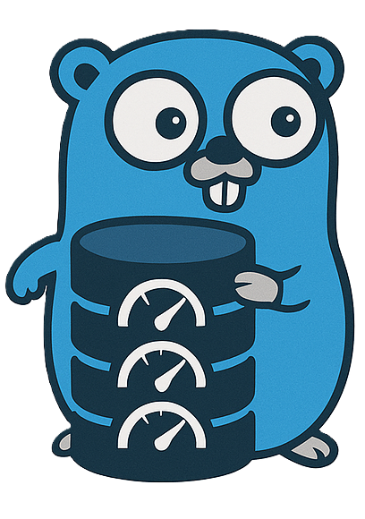

<p align="center">
  <a>
    
  </a>
</p>

<h3 align="center">Cachier</h3>

<p align="center">
  A high-performance, easy-to-use, multi-level caching library for Go.

  <br>
  <br>
  <a href="##installation">Install</a>
  ·
  <a href="##usage">Usage</a>
  ·
  <a href="##license">License</a>
  ·
  <a href="##license">Credits</a>
  ·
  <a href="https://kavin.is-a.dev/blog/soon">Blog</a>

</p>


## Table of contents

- [Installation](##installation)
- [Quick Start](##usage)
- [License](##license)
- [Credits](##credits)

## Installation


To install <b>cachier/v1</b> running the following:
```
$ go get github.com/kavin81/cachier/v1
```

If you plan, on using redis as a L2 cache, install <b>go-redis/v9</b>
```
$ go get github.com/redis/go-redis/v9
```


## Quickstart

```go
import (
  "fmt"
  "time"

  "github.com/kavin81/cachier/v1"
  "github.com/kavin81/cachier/v1/stores"
  "github.com/redis/go-redis/v9"
  "github.com/user/userDB/v1"
)

func main() {
  redisClient := redis.NewClient(&redis.Options{
    Addr: "localhost:6379",
    DB:   0,
  })
  redisDriver := stores.NewRedisCache(redisClient, time.Hour)
  memoryDriver := stores.NewLRUCache(100, 10*time.Minute)

  // New(namespace string, cache.Options{ L1, L2 }
  newCache := cache.New("userDB", cache.Options{
    L1: memoryDriver,
    L2: redisDriver,
  })

  if val, err := newCache.GetOrSet("user:user1", userDB.Fetch("user.user1")); err == nil {
    fmt.Printf("Info has been written to L1 & L2")
  }

  fmt.Printf("%v", newCache.Get("user:user1"))
}
```
> example usage of `cachier@1.0.0`

## License

- This project is licensed under the [MIT](LICENSE) License

## Credits

- This Project was inspired by many other projects, Blogs & Write-ups.
- here are the sources I remember reffering to while building this off memory (pun intended)

| Repo/Link                                                                               	| why?               	|
|-----------------------------------------------------------------------------------------	|--------------------	|
| [ZiggyCreatures/FusionCache](https://github.com/ZiggyCreatures/FusionCache)             	|  Design Reference  	|
| [Stackoverflow](https://stackoverflow.com/questions/8606571/what-is-a-multi-tier-cache) 	| `n/a`              	|
| [TurnerSoftware/CacheTower](https://github.com/TurnerSoftware/CacheTower)               	|  Design Reference  	|
| [Julien-R44/bentocache](https://github.com/Julien-R44/bentocache)                       	|  Design Reference  	|
| [Go with The Domain](https://threedots.tech/go-with-the-domain/)                        	| Project Structure  	|
